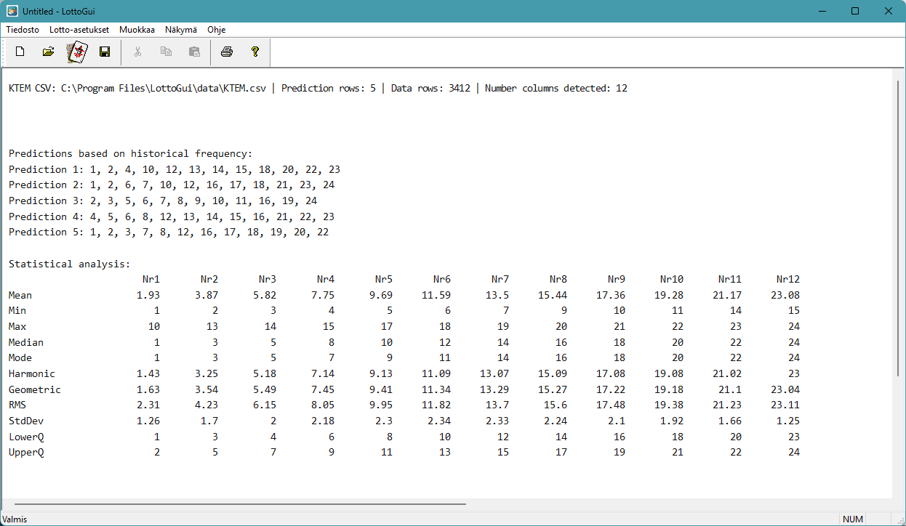

# LottoGui

LottoGui is a small Windows desktop application for generating lottery lines and viewing simple lottery analysis results.

The program is written in C++ with Microsoft Foundation Classes (MFC) and is intended to be opened and built in Microsoft Visual Studio on Windows. The project now supports both Win32 and x64 build targets.



## Features

- Generate classic lottery lines with a custom amount of numbers and rows
- Use either a numeric range or your own input number set
- Save and print generated results
- Analyze Finnish Lotto CSV data from data/SuomenLottoData.csv
- Analyze Milli CSV data from data/MilliData.csv
- Analyze KTEM CSV data from data/KTEM.csv
- Analyze Keno CSV data from data/KenoData.csv
- Analyze Eurojackpot CSV data from data/EurojackpotData.csv
- Analyze Viking Lotto CSV data from data/VikingData.csv
- Analyze Jokeri CSV data from data/JokeriData.csv
- Create frequency-based prediction rows from historical data
- Display statistical analysis for Lotto, Milli, KTEM, Keno, Eurojackpot, Viking Lotto, and Jokeri number columns
- Custom application icon (`LottoGuiIcon.ico`) used by both the application and the installer

## Finnish Lotto CSV analysis

The application includes a separate Suomen Lotto dialog available from the Lotto Options menu. It reads the historical CSV file and shows:

- prediction rows based on historical frequency
- mean
- minimum and maximum
- median
- mode
- harmonic mean
- geometric mean
- root mean square
- standard deviation
- lower and upper quartiles

> Note: the predictions are statistical estimates based on past data and are not guarantees of future results.

## Milli CSV analysis

The application also includes a separate Milli CSV dialog in the Lotto Options menu. It reads historical Milli rows and shows:

- frequency-based prediction rows
- six main-number predictions
- the same statistical analysis used for Suomen Lotto

## KTEM CSV analysis

The application also includes a separate KTEM CSV dialog in the Lotto Options menu. It reads historical Kaikki tai ei mitään rows and shows:

- frequency-based prediction rows
- twelve main-number predictions
- the same statistical analysis used for Suomen Lotto

## Keno CSV analysis

The application also includes a separate Keno CSV dialog in the Lotto Options menu. It reads historical Keno rows and shows:

- frequency-based prediction rows
- ten predicted Keno numbers
- statistical analysis for all 20 draw columns

## Eurojackpot CSV analysis

The application also includes a separate Eurojackpot CSV dialog in the Lotto Options menu. It reads historical Eurojackpot rows and shows:

- frequency-based prediction rows
- five main-number predictions
- two star-number predictions
- the same statistical analysis used for Suomen Lotto

## Viking Lotto CSV analysis

The application also includes a separate Viking Lotto CSV dialog in the Lotto Options menu. It reads historical Viking Lotto rows and shows:

- frequency-based prediction rows
- six main-number predictions
- a Viking number added randomly from 1 to 5 when generating the prediction
- the same statistical analysis used for the other lottery modes

## Jokeri CSV analysis

The application also includes a separate Jokeri CSV dialog in the Lotto Options menu. It reads historical Jokeri rows and shows:

- frequency-based prediction rows
- seven Jokeri digit predictions
- support for repeated digits in the same row
- zero-aware statistical analysis
- harmonic mean displayed as N/A when a column contains zero values

## Data format

The CSV files should be placed in the `data` folder.

### Suomen Lotto example

The Suomen Lotto file contains semicolon-separated rows without a header line, for example:

```text
1;9;18;19;36;37;5
3;14;15;17;20;25;16
```

### Milli example

The Milli file contains semicolon-separated rows without a header line, for example:

```text
4;10;12;18;35;40
3;4;15;20;37;38
```

### KTEM example

The KTEM file contains a header line followed by semicolon-separated data rows in the format No1;No2;No3;No4;No5;No6;No7;No8;No9;No10;No11;No12.

### Keno example

The Keno file contains a header line followed by semicolon-separated data rows in the format No1;No2;...;No20.

### Eurojackpot example

The Eurojackpot file contains a header line followed by semicolon-separated data rows in the format Nr1;Nr2;Nr3;Nr4;Nr5;Star1;Star2.

### Viking Lotto example

The Viking Lotto file contains a header line followed by semicolon-separated data rows in the format Nr1;Nr2;Nr3;Nr4;Nr5;Nr6.

### Jokeri example

The Jokeri file contains a header line followed by semicolon-separated data rows in the format Nr1;Nr2;Nr3;Nr4;Nr5;Nr6;Nr7. Digits may repeat within the same row, and the value 0 is valid.

## Building the project

### Requirements

- Windows
- Microsoft Visual Studio with Desktop development with C++
- MFC support installed
- Win32 or x64 build tools available
- Inno Setup Compiler for creating a Release installer

### Build steps

1. Open the solution file LottoGui.sln in Visual Studio.
2. Select either a Win32 or x64 configuration in Debug or Release mode.
3. Build the solution.
4. Run the application.

## Creating a Release installer

An Inno Setup installer script is included at [installer/LottoGuiSetup.iss](installer/LottoGuiSetup.iss).

1. Build the x64 Release version of the application.
2. Open [installer/LottoGuiSetup.iss](installer/LottoGuiSetup.iss) in Inno Setup Compiler.
3. Compile the script.
4. The installer output is created in [installer/Output](installer/Output).

The installer packages the application executable together with all CSV files from the [data](data) folder.

### Upgrade support

The installer supports in-place upgrades. Installing a new version over an existing one automatically removes the old version first. User data files in the `data` folder are never deleted during upgrade or uninstallation.

### Language selection

During installation the user can choose the UI language:

- **English** — English menu, dialogs, and help file (`LottoGui_en.chm`)
- **Suomeksi (Finnish)** — Finnish menu, dialogs, and help file (`LottoGui.chm`)

The selected language is stored in the registry (`HKLM\SOFTWARE\LottoGui\Language`) and applied automatically each time the application starts.

## Using the application

1. Start the program.
2. Open the Lotto Options menu.
3. Choose one of the available options:
   - Classic Lotto Options (Klassinen lotto)
   - Suomen Lotto CSV
   - Milli CSV
   - KTEM CSV
   - Keno CSV
   - Eurojackpot CSV
   - Viking Lotto CSV
   - Jokeri CSV
4. Generate results and review them in the client area.

## Localisation

The application supports English and Finnish UI languages. All menus, dialog captions, and buttons are translated when Finnish is selected. The language is chosen at install time and can be changed by re-running the installer.

The Finnish resource section in `LottoGui.rc` uses `#pragma code_page(1252)` with `\x`-escaped characters (e.g. `\xe4` for ä, `\xf6` for ö) so that the Windows Resource Compiler correctly maps them to Unicode regardless of the source file encoding.

## Help system

The application ships two compiled HTML Help files:

- `help/LottoGui.chm` — Finnish help
- `help/en/LottoGui_en.chm` — English help

Both are built from HTML sources, a table-of-contents file (`.hhc`), a keyword-index file (`.hhk`), and a project file (`.hhp`) using **HTML Help Workshop** (`hhc.exe`).

### Encoding requirement for HHC and HHK files

`hhc.exe` reads `.hhc` and `.hhk` files as **ANSI (Windows-1252)**, regardless of any charset declaration. The HTML topic files themselves can be UTF-8 (they carry their own `<meta charset>` tag), but the TOC and index files must be saved as Windows-1252, otherwise Scandinavian characters (ä, ö) and special punctuation (–) appear garbled in the compiled CHM's Contents and Index panes.

When editing `.hhc` or `.hhk` files in VS Code, re-save them with the correct encoding:
`Ctrl+Shift+P` → *Change File Encoding* → *Save with Encoding* → **Western (Windows 1252)**.

### Rebuilding the CHM files

```
"C:\Program Files (x86)\HTML Help Workshop\hhc.exe" help\LottoGui.hhp
"C:\Program Files (x86)\HTML Help Workshop\hhc.exe" help\en\LottoGui_en.hhp
```

## Project status

This is a lightweight hobby-style MFC application focused on lottery line generation and simple statistical exploration.
